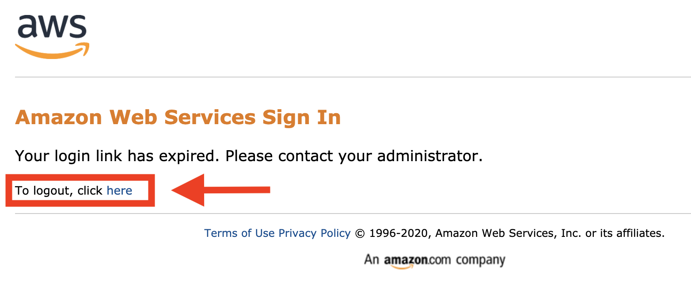
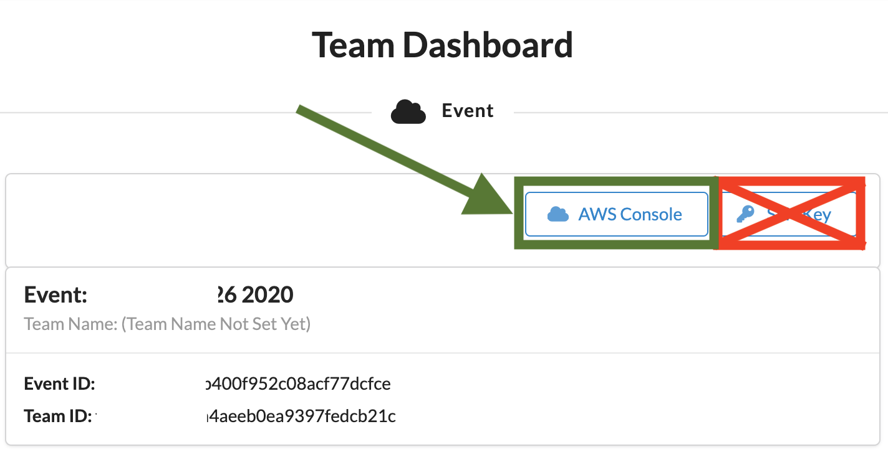

# Instructions on how to log into your temporary AWS account for a SageMaker Workshop

# Workshop Instructions
_Note:  This explains how to log into an ephemeral AWS acccount for each attendee of the workshop. This ephemeral account is not accessible after the workshop.  
## 0. Logout of All AWS Consoles Across All Browser Tabs
If you do not logout of existing AWS Consoles, things will not work properly.

_Please logout of all AWS Console sessions in all browser tabs._

## 1. Login to the Workshop Portal (aka Event Engine). 
Open https://dashboard.eventengine.run/

Using the hash code you got from workshop admins, paste the event-hash-login that will be shared with you in the browser window. 

Choose the Accept Terms & Login. 

Choose OTP.

Write the Email that the passcode will be sent to, and choose Send passcode.

Copy the One-time email passcode from your inbox and paste it here.

Set your name clicking on Set Team Name, and then choose AWS Console.

## 2. Login to the **AWS Console**

Take the defaults and click on **Open AWS Console**. This will open AWS Console in a new browser tab.

If you see this message, you need to logout from any previously used AWS accounts.

_Please logout of all AWS Console sessions in all browser tabs._

Double-check that your account name is similar to `TeamRole/MasterKey` as follows:

If not, please logout of your AWS Console in all browser tabs and re-run the steps above!

## 3. Start the Workshop!
https://github.com/aws-samples/amazon-sagemaker-build-train-deploy/tree/master/01_configure_sagemaker_studio
